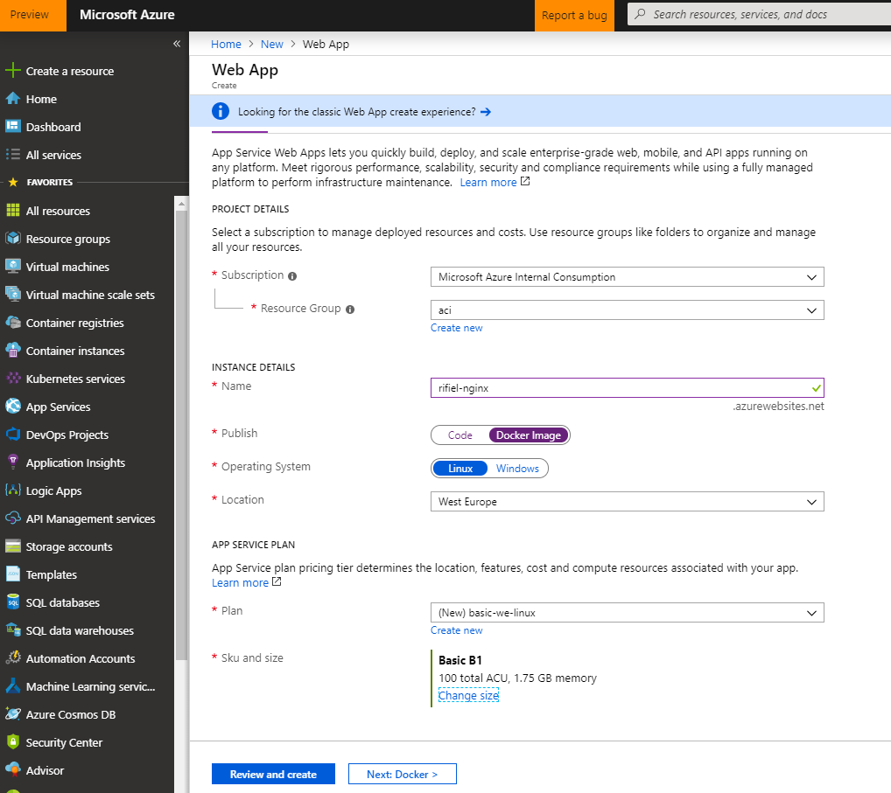
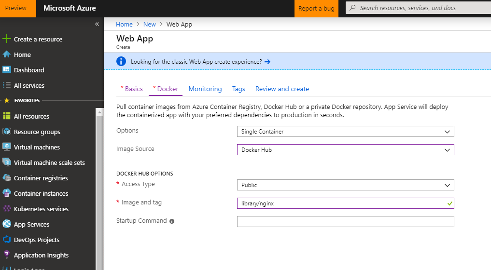

# Containers Lab

**Pre-requisites:** Make sure you've gone thru the steps in [README.md](README.md) before proceeding

In this lab, you'll get familiar with:
- Running an existing Docker image

## Run an existing docker image locally

In a terminal, run: 

`docker run --rm -p 3001:80 library/nginx`

Now browse to `http://(hostname):3001` and check that nginx is running. 

Have a look at other public container images at <https://hub.docker.com/search?q=&type=image>

Questions:
* Notice the "Pulling from library/nginx" message. What does that mean? 
* What does the -p `3001:80` switch mean?

## Run an existing docker image in the cloud - the serverless way

Run the commands below in Azure CLI or Cloud Shell.

Make sure you have a resource group. Eg: 

`az group create -n aci -l westeurope`

Create an Azure Container Instance to run nginx:

`az container create -n mynginx -g <your_rg_here> --ip-address public --image library/nginx`

Notice the IP Address once the operation completes and browse to that address. You've just launched a container.

## Run an existing docker image in the cloud - the PaaS way

Create a Web App for Containers and deploy the public library/nginx image. Use the sample below as reference.

